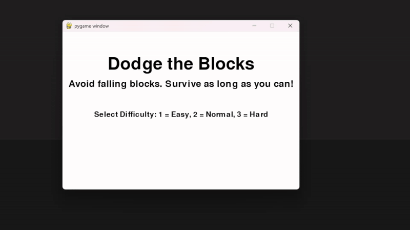

# 🎮 Dodge the Blocks


_A fast-paced arcade game built with Python and Pygame. Dodge the falling blocks, survive as long as you can, and beat your high score!_

---

## 📄 License

This project is licensed under the [MIT License](LICENSE).

## 🖼️ Gameplay Preview

<!-- Replace with a real screenshot or GIF -->


---

## 🕹️ How to Play

- Move left/right using the **arrow keys**
- Avoid falling red blocks
- Score increases the longer you survive
- Lose all lives and it's **Game Over**
- Select difficulty at the start (Easy, Normal, Hard)

---

## ✨ Features

- 🧠 **Difficulty Selection** (1 = Easy, 2 = Normal, 3 = Hard)
- 🎮 **Modular OOP Architecture**: `Player`, `Block`, `Game` classes
- 💾 **High Score Saving** (stored between sessions)
- 🖥️ **Styled Start Menu** with difficulty confirmation
- 🔁 **Dynamic Difficulty**: block speed scales with score
- 🛠️ **Crash-safe file reading** for high score

---

## 🛠️ Installation & Setup

### Requirements:
- Python 3.10 or later
- Pygame

### Run Locally:

```bash
# Install pygame
pip install pygame

# Run the game
python main.py
